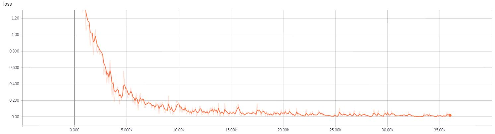

# Densenet-Tensorflow
Tensorflow implementation of [Densenet](https://arxiv.org/abs/1608.06993) using **MNIST**
* The code that implements *this paper* is ***Densenet.py***
* The code that applied *dropout* is ***Densenet_dropout.py***
* There is a *slight difference*, I used ***AdamOptimizer***

## Requirements
* Tensorflow 1.x
* Python 3.x

## Results
* This result does ***not use dropout***
* The number of dense block layers is fixed to ***4***
```python
        for i in range(self.nb_blocks) :
            # original : 6 -> 12 -> 32

            x = self.dense_block(input_x=x, nb_layers=4, layer_name='dense_'+str(i))
            x = self.transition_layer(x, scope='trans_'+str(i))
```
* The highest test accuracy is ***99.2%***

### Accuracy


### Loss



## Author
Junho Kim
