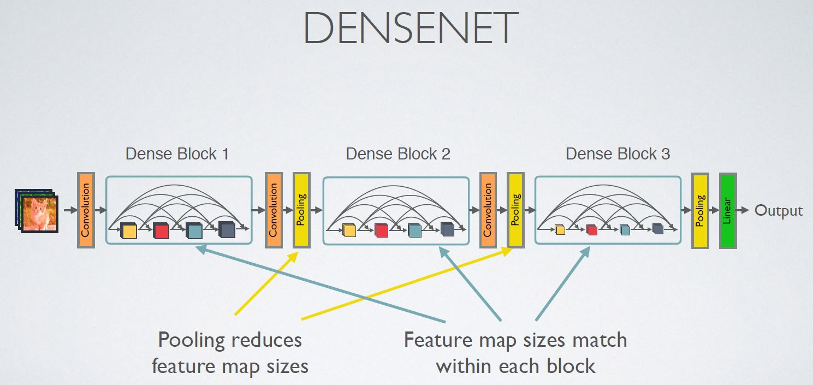
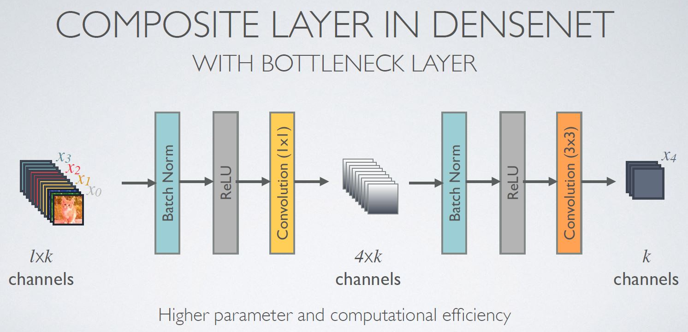
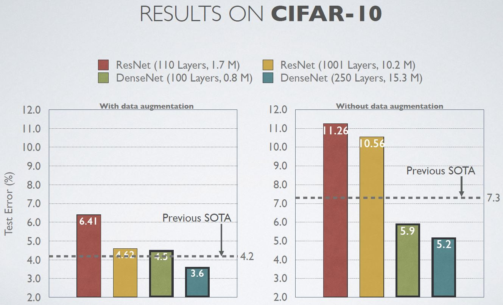

# Densenet-Tensorflow
Tensorflow implementation of [Densenet](https://arxiv.org/abs/1608.06993) using **Cifar10, MNIST**
* The code that implements *this paper* is ***Densenet.py***
* There is a *slight difference*, I used ***AdamOptimizer***

If you want to see the ***original author's code*** or ***other implementations***, please refer to this [link](https://github.com/liuzhuang13/DenseNet)

## Requirements
* Tensorflow 1.x
* Python 3.x
* tflearn (If you are easy to use ***global average pooling***, you should install ***tflearn***
```bash
However, I implemented it using tf.layers, so don't worry
```
## Issue
* I used ***tf.contrib.layers.batch_norm***
```python
    def Batch_Normalization(x, training, scope):
        with arg_scope([batch_norm],
                       scope=scope,
                       updates_collections=None,
                       decay=0.9,
                       center=True,
                       scale=True,
                       zero_debias_moving_mean=True) :
            return tf.cond(training,
                           lambda : batch_norm(inputs=x, is_training=training, reuse=None),
                           lambda : batch_norm(inputs=x, is_training=training, reuse=True))
```

* If not enough GPU memory, Please edit the code
```python
with tf.Session() as sess : NO
with tf.Session(config=tf.ConfigProto(allow_soft_placement=True)) as sess : OK
```

## Idea
### What is the "Global Average Pooling" ? 
```python
    def Global_Average_Pooling(x, stride=1) :
        width = np.shape(x)[1]
        height = np.shape(x)[2]
        pool_size = [width, height]
        return tf.layers.average_pooling2d(inputs=x, pool_size=pool_size, strides=stride) 
        # The stride value does not matter
````
* If you use tflearn, please refer to this [link](http://tflearn.org/layers/conv/#global-average-pooling)
```python
    def Global_Average_Pooling(x):
        return tflearn.layers.conv.global_avg_pool(x, name='Global_avg_pooling')
```

### What is the "Dense Connectivity" ?


### What is the "Densenet Architecture" ?

```python
    def Dense_net(self, input_x):
        x = conv_layer(input_x, filter=2 * self.filters, kernel=[7,7], stride=2, layer_name='conv0')
        x = Max_Pooling(x, pool_size=[3,3], stride=2)

        x = self.dense_block(input_x=x, nb_layers=6, layer_name='dense_1')
        x = self.transition_layer(x, scope='trans_1')

        x = self.dense_block(input_x=x, nb_layers=12, layer_name='dense_2')
        x = self.transition_layer(x, scope='trans_2')

        x = self.dense_block(input_x=x, nb_layers=48, layer_name='dense_3')
        x = self.transition_layer(x, scope='trans_3')

        x = self.dense_block(input_x=x, nb_layers=32, layer_name='dense_final') 
        
        x = Batch_Normalization(x, training=self.training, scope='linear_batch')
        x = Relu(x)
        x = Global_Average_Pooling(x)
        x = Linear(x)

        return x
```

### What is the "Dense Block" ?

```python
    def dense_block(self, input_x, nb_layers, layer_name):
        with tf.name_scope(layer_name):
            layers_concat = list()
            layers_concat.append(input_x)

            x = self.bottleneck_layer(input_x, scope=layer_name + '_bottleN_' + str(0))

            layers_concat.append(x)

            for i in range(nb_layers - 1):
                x = Concatenation(layers_concat)
                x = self.bottleneck_layer(x, scope=layer_name + '_bottleN_' + str(i + 1))
                layers_concat.append(x)

            return x
```

### What is the "Bottleneck Layer" ?
```python
    def bottleneck_layer(self, x, scope):
        with tf.name_scope(scope):
            x = Batch_Normalization(x, training=self.training, scope=scope+'_batch1')
            x = Relu(x)
            x = conv_layer(x, filter=4 * self.filters, kernel=[1,1], layer_name=scope+'_conv1')
            x = Drop_out(x, rate=dropout_rate, training=self.training)

            x = Batch_Normalization(x, training=self.training, scope=scope+'_batch2')
            x = Relu(x)
            x = conv_layer(x, filter=self.filters, kernel=[3,3], layer_name=scope+'_conv2')
            x = Drop_out(x, rate=dropout_rate, training=self.training)
            
            return x
```

### What is the "Transition Layer" ?
```python
    def transition_layer(self, x, scope):
        with tf.name_scope(scope):
            x = Batch_Normalization(x, training=self.training, scope=scope+'_batch1')
            x = Relu(x)
            x = conv_layer(x, filter=self.filters, kernel=[1,1], layer_name=scope+'_conv1')
            x = Drop_out(x, rate=dropout_rate, training=self.training)
            x = Average_pooling(x, pool_size=[2,2], stride=2)

            return x
```

## Compare Structure (CNN, ResNet, DenseNet)


## Results
* (***MNIST***) The highest test accuracy is ***99.2%*** (This result does ***not use dropout***)
* The number of dense block layers is fixed to ***4***
```python
    for i in range(self.nb_blocks) :
        # original : 6 -> 12 -> 48

        x = self.dense_block(input_x=x, nb_layers=4, layer_name='dense_'+str(i))
        x = self.transition_layer(x, scope='trans_'+str(i))
```

### CIFAR-10


### CIFAR-100


### Image Net


## Related works
* [ResNeXt-Tensorflow](https://github.com/taki0112/ResNeXt-Tensorflow)
* [SENet-Tensorflow](https://github.com/taki0112/SENet-Tensorflow)

## References
* [Korean](https://www.youtube.com/watch?v=fe2Vn0mwALI)
* [English](https://www.youtube.com/watch?v=-W6y8xnd--U)
* [Classification Datasets Results](http://rodrigob.github.io/are_we_there_yet/build/classification_datasets_results.html)

## Author
Junho Kim
